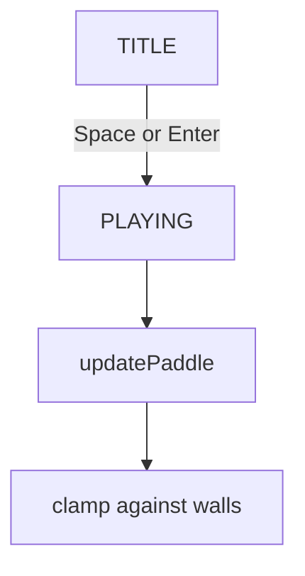

# Iteration 1 — the bat

The first playable snapshot of Kinetile. There is a title screen, a
playfield with walls, and a bat that slides left and right. There is
no ball yet.

The picture is monochrome: white ink on a black field. The colour logo
is drawn through a grayscale filter so the title screen still belongs
to this era of the game.

## What this iteration adds

- A title screen that shows the Kinetile logo
- Keyboard-driven bat movement
- Side and top walls that the bat cannot pass
- A fixed-timestep game loop that later physics can share

## How it works

`game.js` owns the state machine. On the title screen the only useful
input is an action key. Once play starts, `updatePaddle` reads left and
right input every 1/120 s tick and integrates the bat’s position.

The bat is stored as a centre point plus a width. Clamping uses that
centre so later power-ups can change the width without rewriting the
boundary maths.

The renderer (`render.js`) is the only module that talks to the canvas.
`main.js` sizes the backing store by `devicePixelRatio` so the 960×720
logical playfield stays sharp on retina displays.

## Controls

- **A / Left** — move left
- **D / Right** — move right
- **Space / Enter** — leave the title screen

## Tests

`tests/paddle.test.js` checks movement, opposing keys, and wall
clamps. `tests/game.test.js` checks the title transition and that
`advance` consumes time in fixed ticks.
