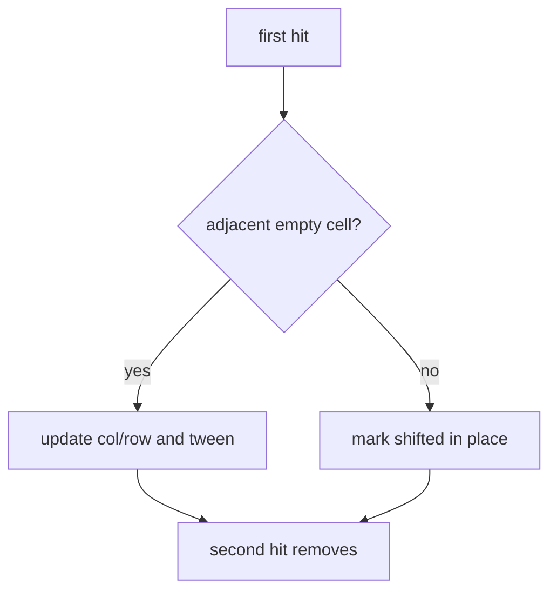

# Iteration 14 — shifting tiles

The last snapshot adds restless bricks. A dashed violet tile, when
first hit, slides into an adjacent empty cell if one exists. A second
hit is then needed to remove it. The slide is a short tween so the
eye can follow the move.

## What this iteration adds

- Shifting bricks mixed into seeded layouts
- Adjacent-cell vacancy search (up, down, left, right)
- A 0.14 s tween from the old cell to the new one
- A second-hit rule even when no neighbour is free

## How it works

`adjacentVacancies` ignores the brick’s own cell and the arena
border. The destination is chosen with the drop RNG so tests can
force the first vacancy by returning 0.

Collision uses the new cell immediately. The tween is cosmetic: the
ball has already bounced, and the brick is logically where it will
land. That avoids a frame where two cells both claim the tile.

Shifting is positional (`(col + row) % 7 === 3`) so it does not
collide with the armour cadence from iteration 13.

This is the complete Kinetile rule set: bat, ball, lives, bricks,
levels, colour, sound, scores, five power-ups, armour, and restless
tiles.

## Tests

New specs cover a slide into a known vacancy, a settle-in-place when
boxed in, a second hit destroying the brick, and the tween timer
counting down.
