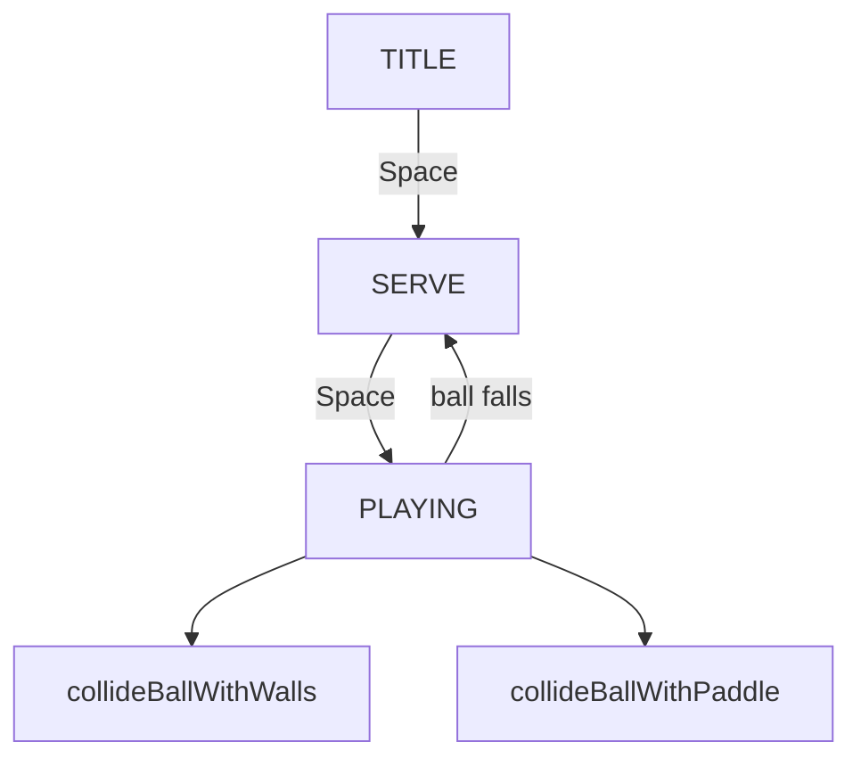

# Iteration 2 — the ball

The bat now has something to hit. A ball rests on the bat in a serve
state, launches on Space, and bounces off the walls and the bat. If it
falls off the bottom it returns to serve — lives arrive in the next
snapshot.

The picture is still monochrome.

## What this iteration adds

- A ball that follows the bat until served
- Wall reflections on the left, right, and top
- Bat reflection whose angle depends on where the ball lands
- A minimum vertical component so the path cannot lock horizontal

## How it works

During `SERVE` the ball is glued to the bat so the player can choose
a launch position. `serveBall` then sets a velocity of fixed speed
and a slight leftward angle.

Bat hits are not a simple vertical flip. The offset of the ball from
the bat centre is mapped onto an angle of up to 75° from vertical.
A floor on the vertical component (`MIN_VERTICAL_RATIO`) stops the
ball from skimming left and right forever.

Collision tests live in `physics.js` and stay free of the DOM so they
can run under Vitest.

## Controls

- **A / Left** and **D / Right** — move the bat
- **Space / Enter** — start from the title screen, then serve

## Tests

Carried-forward bat tests sit alongside new specs for wall bounce, bat
angle reflection, the serve state, and a miss returning to serve.
