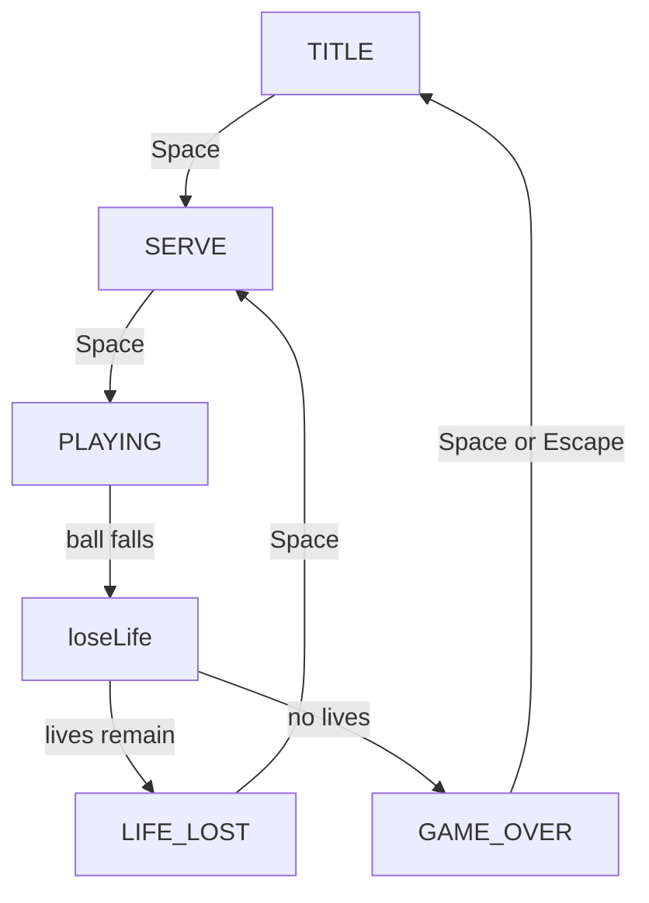

# Iteration 3 — lives

Missing the ball now costs something. A match starts with three lives.
Each drop into the pit removes one. When the last life is gone the
game ends and the title screen is a keypress away.

The picture is still monochrome.

## What this iteration adds

- Three lives at the start of a match
- A life indicator in the HUD
- A `LIFE_LOST` pause so the next serve is deliberate
- A `GAME_OVER` state after the final miss

## How it works

`loseLife` is the only place that decrements `game.lives`. That keeps
the rule in one function so later scoring and sound can hook the same
event.

The bat is left where it was after a miss. Only a new match recentres
it, which feels less punitive than a full reset after every drop.

## Controls

- **A / Left** and **D / Right** — move the bat
- **Space / Enter** — start, serve, continue after a lost life
- **Escape** — return to the title screen from game over

## Tests

Carried-forward bat and physics specs remain. New game tests cover the
life counter, the `LIFE_LOST` pause, and the transition into
`GAME_OVER` on the third miss.
