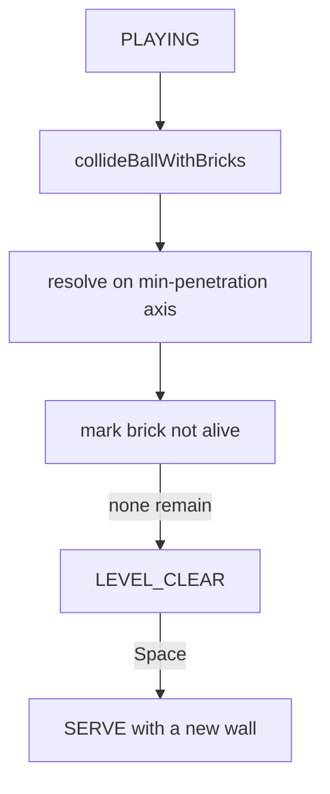

# Iteration 4 — the wall

The playfield now has something to destroy. An 8×14 brick wall fills
the top of the arena, matching the original Breakout grid. The ball
bounces off a brick and removes it. When the last brick falls the wall
is cleared.

The picture is still monochrome.

## What this iteration adds

- A fixed 8-row, 14-column brick wall
- Circle-versus-rectangle collision resolved on the shallowest overlap
- Brick removal on a hit
- A `LEVEL_CLEAR` state that rebuilds the same wall for another go

## How it works

Bricks live on a regular grid. Each cell is 64×24 including a 2-pixel
gap, which tiles cleanly across the 928-pixel inner playfield.

When the ball overlaps a brick, `resolveCircleAabb` compares the four
overlap depths and reflects on the smaller axis. That is enough to
choose a side versus a top hit without a full swept test, and at
120 ticks a second the ball cannot tunnel through a brick.

Only one brick is processed per tick. The speed cap keeps a tick’s
travel under half a brick thickness, so the ball cannot skip a cell.

## Controls

Unchanged from iteration 3, plus Space to start the next wall after a
clear.

## Tests

New specs cover the 112-brick layout, a single-brick bounce that
removes the brick, and clearing the wall when the last brick is hit.
Carried-forward bat, wall, bat-angle, and life tests still run.
