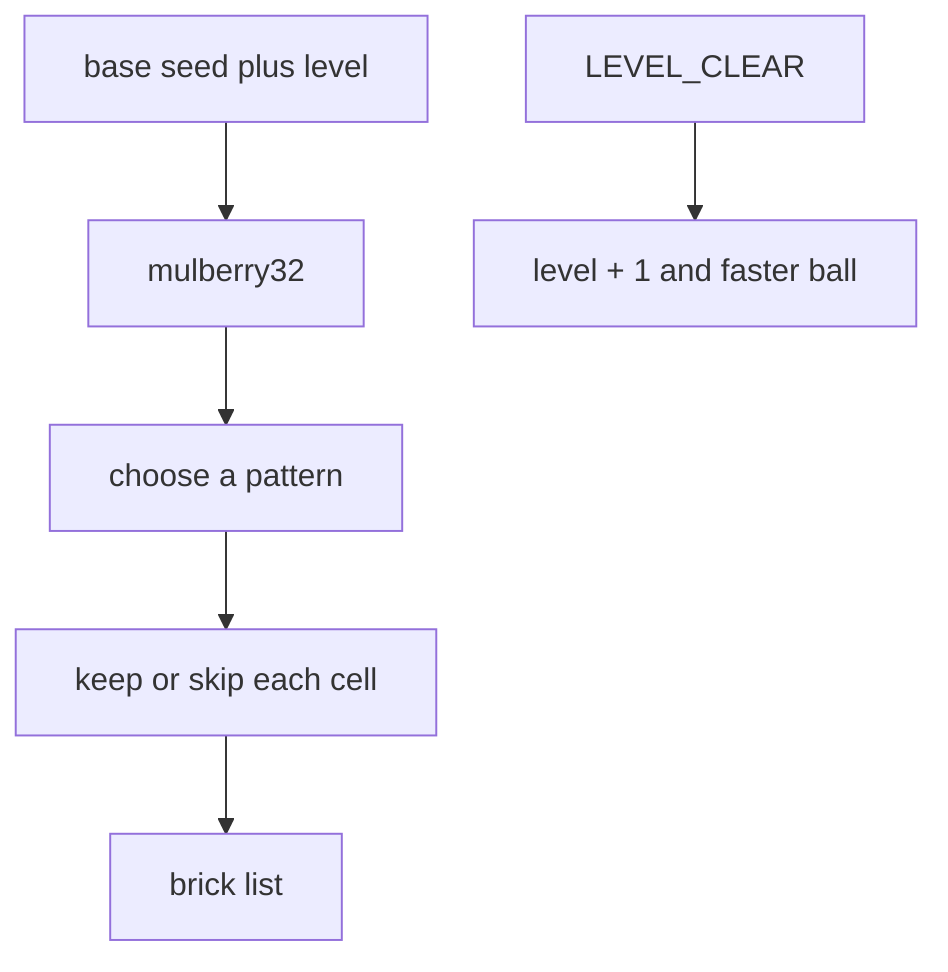

# Iteration 5 — levels

The wall is no longer a single fixed rectangle. Each level builds a
formation from a seeded generator, and the ball speeds up as the
level counter climbs.

The picture is still monochrome. Colour arrives next.

## What this iteration adds

- A level counter in the HUD
- Seeded random formations (sparse, checker, pyramid, striped)
- A per-level ball speed ramp, capped so a tick cannot tunnel
- A `LEVEL_CLEAR` advance that loads the next seed rather than
  rebuilding the same wall

## How it works

`mulberry32` is a tiny, deterministic PRNG. `seedForLevel` mixes the
base seed with the level number so level 3 of a given run is always
the same wall. Tests pass an explicit seed and assert that two calls
produce identical layouts.

Four patterns keep the walls readable rather than pure noise:

- Sparse random holes
- A checkerboard
- A centred pyramid
- Even rows, with odd rows punched at random

Ball speed is `BALL_SPEED + (level - 1) * 28`, capped at 520 px/s.
At 120 Hz that is still under 5 pixels a tick, well below half a
brick thickness.

## Controls

Unchanged, except Space after a clear now starts the next level.

## Tests

New specs cover generator determinism, differing layouts across
levels, the speed ramp, and advancing `game.level` after a clear.
