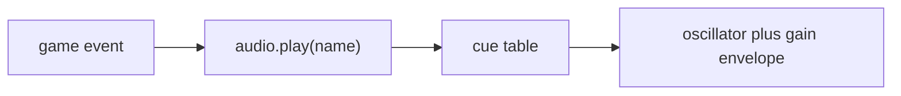

# Iteration 6 — colour and sound

Monochrome ends here. The playfield picks up the logo’s neon palette,
and every meaningful collision plays a short synthesised tone. There
are no audio files: the Web Audio API builds each cue from an
oscillator and a gain envelope.

## What this iteration adds

- A full colour palette for walls, bat, ball, HUD, and bricks
- Row-tinted bricks that echo classic Breakout banding
- The colour logo on the title screen, no longer forced to grayscale
- Synthesised cues for serve, wall, bat, brick, life lost, clear, and
  game over

## How it works

`game.js` never talks to `AudioContext`. It calls `game.audio.play`
on a tiny adapter. The browser adapter (`createAudio`) unlocks the
context on the first key press — browsers block sound until a gesture.
Tests inject `createSilentAudio()`, which records cue names and does
not touch the Web Audio API.

Brick colours come from `palette.js` and are keyed by row so a
pyramid or checker still reads as bands of colour.

## Controls

Unchanged. The first key press also unlocks audio.

## Tests

A new audio spec checks that serve, brick, life, and game-over events
emit the matching cue names. Carried-forward physics and level tests
still run against a silent adapter.
