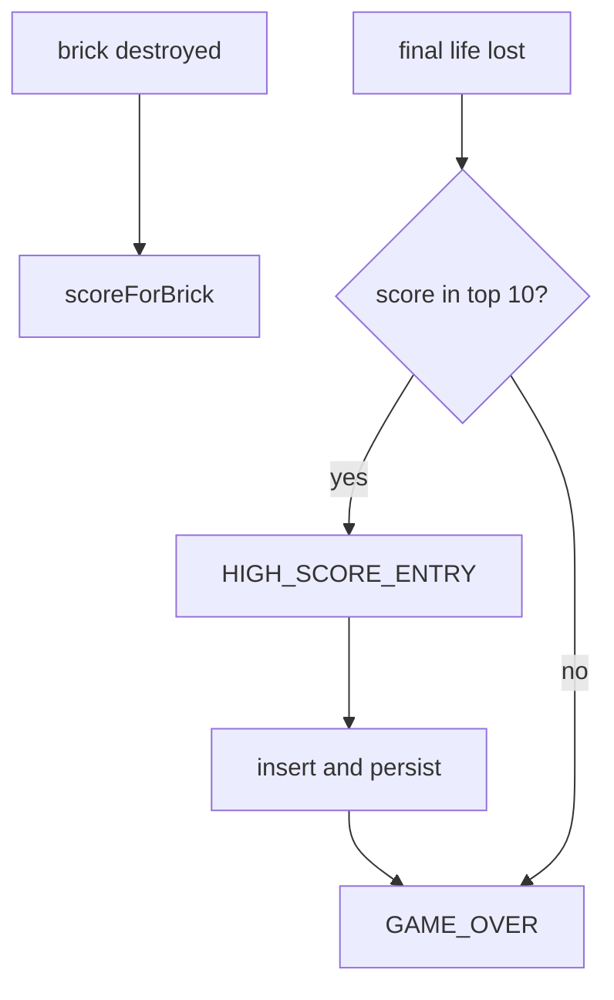

# Iteration 7 — scoring

Bricks are now worth points, and a finished match can write a name
into a top-ten table. The table is stored in `localStorage` so it
survives a refresh, and tests use an in-memory stand-in so they stay
DOM-free.

## What this iteration adds

- A running score in the HUD
- Higher rows are worth more than lower ones
- A top-10 high-score table on the title and game-over screens
- Arcade-style three-letter name entry when the score qualifies

## How it works

A brick’s value is `50 + (7 - row) * 10`, so the top row is 120 and
the bottom row is 50. Points are awarded only when the brick is
actually removed, which leaves room for multi-hit bricks later.

`scores.js` talks to a storage adapter with `getItem` / `setItem`.
The browser adapter is `localStorage`. Tests pass
`createMemoryStorage()` so a qualifying score can be asserted without
touching disk.

Name entry consumes letter key-down events one at a time. Backspace
edits, Enter commits. An empty name is padded to `AAA` only if the
player somehow confirms without typing; the UI requires at least one
letter.

## Controls

- Letters — enter a high-score name
- Backspace — delete a letter
- Space / Enter — start, serve, confirm a name
- Escape — return to the title screen from game over

## Tests

New specs cover brick values, table insertion, qualification, and the
name-entry state machine. Existing physics and life tests still pass
with a memory store.
