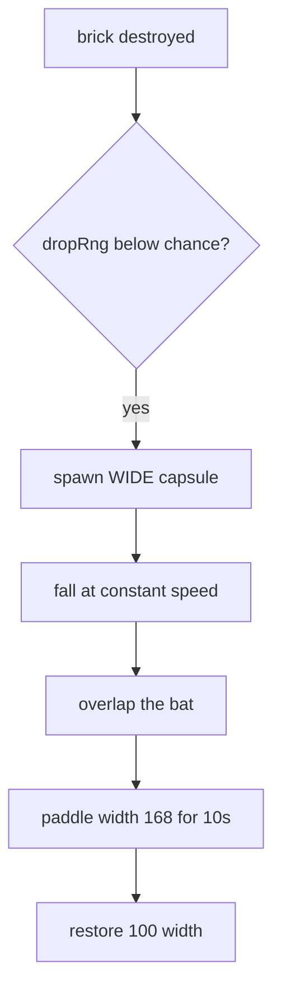

# Iteration 8 — wide bat

This snapshot introduces the power-up framework that later Arkanoid
effects will share. Some destroyed bricks drop a falling capsule.
Catch it with the bat to grow the bat for ten seconds.

## What this iteration adds

- A drop chance on destroyed bricks, driven by a seeded RNG
- Falling capsules that the bat can collect
- The wide-bat effect, time-limited to ten seconds
- A refresh-on-recatch rule: catching another wide capsule resets
  the timer

## How it works

`maybeDropPowerUp` asks the drop RNG twice: once for “does anything
drop?” and once for “which type?”. Iteration 8 only has `WIDE`, so
the second roll always lands on that type, but the function is ready
for later catalogues.

Effects live on `game.effects` as remaining seconds. `tickEffects`
runs during serve and play so a timer started mid-rally can expire
even if the player is lining up the next serve. A new match calls
`resetEffects` so a previous run cannot leak a wide bat onto the
title screen.

## Controls

Unchanged. Steer under a capsule to collect it.

## Tests

New specs cover a forced drop, collection widening the bat, timer
expiry restoring the original width, and a recatch refreshing the
timer.
