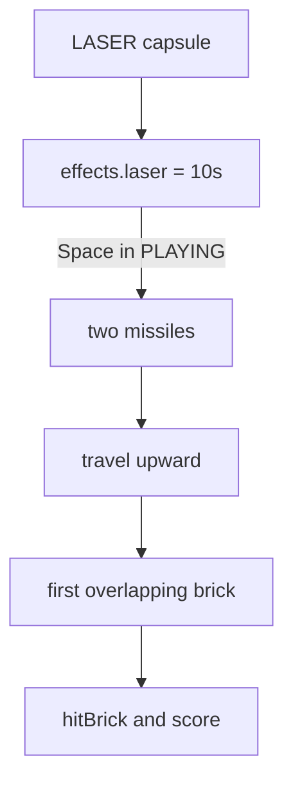

# Iteration 9 — lasers

A magenta capsule arms the bat with twin guns. For ten seconds, Space
fires a pair of missiles that travel straight up and destroy the first
brick they meet.

## What this iteration adds

- The `LASER` power-up in the shared capsule catalogue
- Twin missiles launched from the bat ends
- A short fire cooldown so a held key cannot machine-gun the wall
- Brick destruction and scoring through the same path as a ball hit

## How it works

Space is still the serve key. During `SERVE` it launches the ball.
During `PLAYING`, and only while `effects.laser` is above zero, it
fires. The cooldown (`0.28 s`) is stored on the game so tests can
assert that a second shot in the same tick is ignored.

Missiles are axis-aligned rectangles. That is enough: they move only
on Y, and a brick is much wider than a bolt.

## Controls

- **Space** — serve, or fire lasers while the effect is active

## Tests

New specs cover arming, firing two bolts, destroying a brick, and the
cooldown. Wide-bat tests still pass; a cooperating RNG now lands on
`WIDE` first because it is still index 0 in the catalogue.
